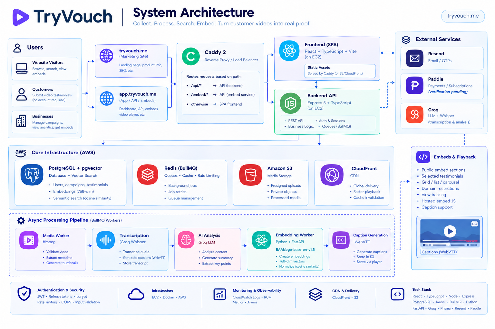

<div align="center">

# Vouch

**Turn customer videos into searchable proof.**

Collect, transcribe, and semantically search video testimonials, then embed them anywhere.

[](https://nodejs.org)
[](https://www.typescriptlang.org)
[](https://github.com/pgvector/pgvector)
[](https://redis.io)
[]()

[Live Demo](https://tryvouch.me) · [Report a Bug](https://github.com/zoxt/vouch/issues) · [Request a Feature](https://github.com/zoxt/vouch/issues)

</div>

---

## Table of Contents

- [Overview](#overview)
- [Why I Built This](#why-i-built-this)
- [Features](#features)
- [Architecture](#architecture)
- [Processing Pipeline](#processing-pipeline)
- [Semantic Search](#semantic-search)
- [Embeds](#embeds)
- [Authentication and Security](#authentication-and-security)
- [Billing](#billing)
- [Tech Stack](#tech-stack)
- [Engineering Decisions](#engineering-decisions)
- [Repository Layout](#repository-layout)
- [Known Trade-offs](#known-trade-offs)
- [Getting Started](#getting-started)
- [Roadmap](#roadmap)

---

## Overview

Vouch is a platform for collecting, processing, searching, and embedding customer video testimonials.

A customer opens a link, records a video, and submits it. No account, no friction. From there, Vouch runs the submission through an asynchronous pipeline: validation, transcription, captioning, AI analysis, and semantic embedding, and turns it into part of a searchable library the business can query in plain language and publish anywhere as an embeddable wall.

> **Status:** deployed and usable end to end.

---

## Why I Built This

I built Vouch to learn backend engineering past the point of CRUD apps: what actually changes when a system has to deal with large files, background workers, external AI services, storage, and delivery, instead of just serving JSON from a database.

It started as a simple "collect video testimonials" idea and grew into an asynchronous media pipeline with authentication, rate limiting, semantic search, and real infrastructure around it. The architecture below is the result of hitting real problems during development, not a plan drawn up in advance.

---

## Features

**For businesses (owners)**
- Create testimonial campaigns or one-off requests
- Share a public, unauthenticated submission link
- Get videos automatically validated, transcribed, captioned, and analyzed
- Search the testimonial library by meaning, not just keywords
- Publish testimonials as an embeddable wall, with per-embed domain restrictions

**For customers**
- Open a public link, no account needed
- Record or upload a video (or submit text) directly
- Done. No dashboard, no extra steps

**For site visitors**
- Watch a captioned, embeddable testimonial wall dropped into someone else's page: fast, indexable, and server-rendered rather than shipped as an SPA bundle

---

## Architecture

Three different audiences (owner, client, visitor) hit three different surfaces of the same system, which is what makes the design non-trivial. The dashboard needs auth and real-time state. The submission flow needs to work anonymously and reliably from a phone camera. The embed needs to be fast, cacheable, and safe to iframe from someone else's domain.



One bundle serves both the marketing apex and the app subdomain, sharing a session cookie, with a host-canonicalization guard at the router level. It is more moving parts than a single-host SPA, but it keeps marketing SEO and the app cleanly separated.

---

## Processing Pipeline

Video processing stays off the request/response path. A submission is confirmed the moment the upload lands in S3, and everything expensive happens afterward on isolated workers.

```
Client uploads directly to S3 (presigned URL), then confirms
        │
        ▼
Media worker: ffmpeg validates codec/audio, extracts thumbnail
        │
        ▼
Transcription worker: Groq whisper-large-v3 (verbose_json)
        │                also builds WebVTT captions (never fails the job)
        ▼
AI worker: Groq LLM extracts sentiment, industry, pain points, outcomes, objections
        │
        ▼
Embedding worker: calls the embedding-service, writes a 768-dim vector to pgvector
```

Each stage is its own BullMQ queue and its own worker process, so an `ffmpeg` hang or a Groq outage degrades that single stage, with retries and a dead-letter queue, instead of taking down the API.

---

## Semantic Search

Testimonials are searched by meaning, not exact keyword match.

- Each transcript is embedded with a self-hosted `bge-base` model (`BAAI/bge-base-en-v1.5`), run behind a small Python/FastAPI microservice.
- The resulting 768-dimensional normalized vector is stored in the same PostgreSQL instance using `pgvector`. No separate vector database to operate.
- A search query is embedded with the same model and instruction prefix, then compared against stored vectors by cosine distance.

Each testimonial is currently represented by a single embedding rather than chunked into several: simple, and enough at current scale. A dedicated vector store or per-chunk embeddings become worth considering somewhere past a few hundred thousand testimonials.

---

## Embeds

The public embed surface is deliberately server-rendered, not an SPA, so testimonial walls are fast, indexable, and safe for other sites to load.

- A two-line loader script injects an iframe onto the owner's page.
- Testimonial cards message the parent window (origin-verified) to open a lightbox player.
- Captions are served as WebVTT and rendered through a custom overlay in the player.
- `frame-ancestors` is set per embed from an allowlist. Empty means anywhere may frame it, otherwise only the domains the owner specifies.

---

## Authentication and Security

- JWT access tokens over HTTP-only cookies
- Refresh token rotation and server-side revocation (logout, password change, or reuse all invalidate sessions)
- Password hashing with bcrypt, email verification via OTP
- Redis-backed rate limiting
- Structured logging with request IDs (Pino)
- Zod validation on every body-carrying route
- CORS and credential controls, with separate signed and public flows for anonymous testimonial submission

Nothing here is oversold as enterprise-grade. It is the baseline a system handling user auth and public anonymous submissions needs.

---

## Billing

Entitlements come from a normalized `Subscription { plan, status }` row driven by Paddle webhooks, verified with the official SDK and IP-allowlisted, so switching or adding a payment provider later does not touch feature code.

---

## Tech Stack

| Layer | Choice |
|---|---|
| Frontend | React 18, TypeScript, Vite, Tailwind CSS, React Router, Radix UI |
| API | Node.js, TypeScript, Express 5, Zod v4, Pino |
| Database | PostgreSQL (Supabase) via Prisma 7, pgvector |
| Queue | Redis, BullMQ (media, transcription, ai, embedding workers) |
| Storage | AWS S3 (presigned uploads) + CloudFront |
| AI | Groq: `whisper-large-v3` transcription, GPT-OSS-120B analysis |
| Embeddings | Self-hosted FastAPI microservice, `BAAI/bge-base-en-v1.5`, 768-dim |
| Email | Resend |
| Billing | Paddle |
| Edge | Caddy 2 (host split, TLS, `frame-ancestors`) |
| Deploy | GitHub Actions, GHCR, Docker Compose on EC2 |

---

## Engineering Decisions

**Direct-to-S3 uploads.** Video files go straight from the browser to S3 via presigned URLs instead of passing through the Node API. Keeps large uploads off the API server's bandwidth and out of the request/response path.

**Everything expensive is async.** Transcription, AI analysis, and embedding generation all run as BullMQ jobs, retryable independently, so one slow or failing stage does not block the others or the API.

**pgvector instead of a separate vector database.** Embeddings live alongside relational data in the same Postgres instance. One less moving part to operate, at the cost of becoming a bottleneck at much larger scale.

**Embedding model in its own service.** The `bge-base` model runs behind a dedicated Python/FastAPI process rather than inside the Node API, so it can have its own runtime and dependencies without coupling to the rest of the backend.

**CloudFront for delivery.** S3 handles storage, CloudFront handles playback delivery. The API is never in the path of serving large video files.

**Email reliability split by criticality.** OTP email throws on failure, because login must never silently break. Notification email is fire-and-forget and can never fail a business operation.

---

## Repository Layout

```
src/
  index.ts            Express app: middleware, route mounting, error handling
  config/              env (Zod-validated), prisma, redis, s3, logger
  routes/              express routers, one per resource
  controllers/         request/response only, calls services, asyncHandler everywhere
  services/            business logic, throws ApiError, never touches req/res
  validators/          Zod schemas per route
  middlewares/         auth, rate-limit, validate, errorHandler, not-found
  queues/               BullMQ queue definitions
  workers/              one process per queue
  utils/                ApiError, slugify, url, media, captions (VTT), html
  views/                server-rendered embed pages (template literals, no view engine)
  scripts/              operational scripts (DLQ inspection and retry, etc.)
embedding-service/     Python / FastAPI embedding microservice
prisma/                 schema.prisma and migrations
docs/                   architecture diagram
```

The layering rule is strict throughout: controllers never touch Prisma, services never touch `req`/`res`, every body-carrying route is validated, and env vars are validated once on boot.

---

## Known Trade-offs

- **Single Postgres instance for both relational data and vectors.** Fine at this scale; a dedicated vector store is worth revisiting past roughly a few hundred thousand testimonials.
- **Transcription depends on Groq availability.** The pipeline retries and dead-letters cleanly, but a Groq outage means transcripts and captions queue up behind it.
- **Two-host, one-bundle setup adds real complexity.** Worth it for the SEO and marketing separation, but it is more moving parts than a single-host SPA.

---

## Getting Started

### Prerequisites

- Node.js 20+
- Python (for the embedding service)
- PostgreSQL (or Supabase) with the `pgvector` extension
- Redis
- Docker
- AWS credentials for S3/CloudFront
- Groq API key
- Resend API key

### Installation

```bash
git clone https://github.com/zoxt/vouch.git
cd vouch

# install dependencies
npm install

# configure environment
cp .env.example .env        # fill in DATABASE_URL, REDIS_URL, S3, Groq, Resend keys

# generate the Prisma client and apply migrations
npx prisma generate
npx prisma migrate deploy

# start local infrastructure (Redis, etc.)
docker compose up -d

# start the API
npm run dev

# start the background workers, in a separate terminal
npm run workers
```

The embedding service under `embedding-service/` runs separately as its own FastAPI app. See that folder for its own setup.

> Exact scripts, ports, and env variables should be checked against the current `package.json` and `.env.example` in the repo. This section covers the shape of local setup, not a guarantee of every flag.

---

## Roadmap

- [ ] Chunked, multi-segment embeddings for longer testimonials
- [ ] Expanded embed layout options

---

<div align="center">

Built by [Husban](https://github.com/zoxt) to learn what production backend engineering actually looks like.

</div>