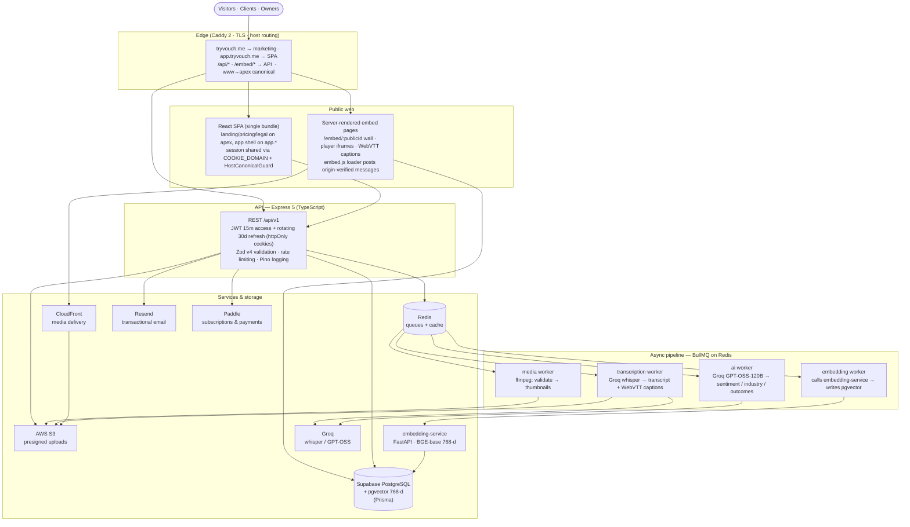
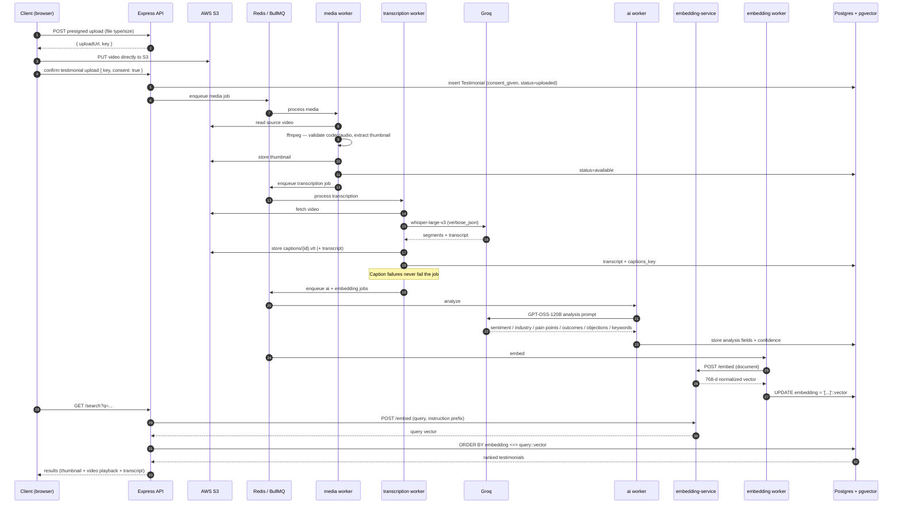

# Vouch — System Architecture

**Vouch** is a testimonial collection platform. Owners create campaigns or one-time
requests, share public links, and collect **video or text testimonials**. Uploads run
through an asynchronous pipeline (validation → thumbnails → transcription → captions →
AI analysis → embeddings) and can be published as **iframe-based embeddable walls** on the
owner's own website.

| Layer | Technology |
| --- | --- |
| Frontend | React 18 + TypeScript + Vite, React Router, Tailwind CSS |
| API | Node.js + Express 5, Zod v4 validation, JWT auth, Pino logging |
| Database | PostgreSQL (Supabase) via Prisma, `pgvector` for semantic search |
| Queue | Redis + BullMQ (4 workers: media · transcription · ai · embedding) |
| Media | AWS S3 (presigned uploads) + CloudFront delivery, ffmpeg in the media worker |
| AI | Groq (`whisper-large-v3` transcription, GPT-OSS-120B analysis) + self-hosted BGE-base embedding service |
| Email | Resend (transactional: OTP, notification) |
| Billing | Paddle (SDK webhooks — signature + IP-allowlist verified server-side) |
| Edge | Caddy 2 reverse proxy (marketing apex / app subdomain split, TLS) |

---

## System architecture

---

## Testimonial submission pipeline

---

## Notable decisions

- **Asynchronous everything.** Uploads are confirmed instantly; heavy work (ffmpeg,
  transcription, AI, embeddings) runs on isolated BullMQ workers so the API stays fast and
  failures are retried or dead-lettered (DLQ tooling included).
- **Clipboard-safe embeds.** Publishers drop a small `embed.js` loader that injects an
  iframe pointing at server-rendered pages. Card clicks `postMessage` to the parent, which
  opens a lightbox player with a custom WebVTT caption overlay. Caddy+iframe security uses
  `frame-ancestors` from the embed's `allowed_domains` (empty = anywhere may frame).
- **Semantic search, not just keywords.** Transcripts + AI analysis are embedded with a
  self-hosted `bge-base` model and searched via `pgvector` cosine distance right in the
  primary Postgres instance — no separate vector database to operate.
- **Domain split.** One SPA bundle serves both the marketing apex (`tryvouch.me`) and the
  app (`app.tryvouch.me`); a shared cookie domain keeps one session across hosts and a
  server + client canonical guard keeps every URL on the correct host.
- **Provider-agnostic billing.** Entitlements derive from a normalized
  `Subscription { plan, status }` model backed by Paddle; webhooks are unmarshalled with the
  official SDK, signature-verified, and IP-allowlisted before they map to a user.
- **Email reliability split.** OTP email *throws* on failure (login must not silently
  break); notification emails are fire-and-forget and must never block business operations.